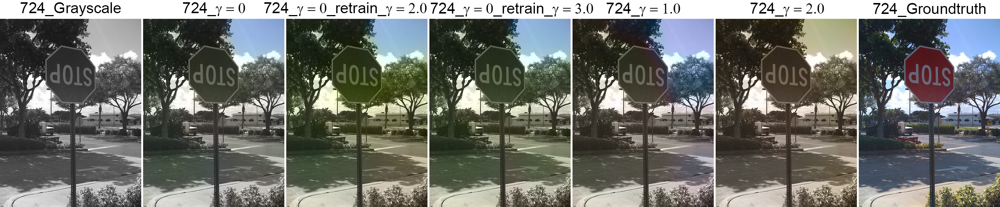

# Colorization
### Towards More Vibrant Colorful Image Colorization
Final project for CSE 203B Convex Optimization Course

Sample output images: (The groundtruth of `#1490` is grayscale. `gamma` is `color_vivid_gamma` in our loss function. `retrain` means retraining for 10 epochs; otherwise, it's training for 20 epochs.)

## Group Members 
  * Ahan Mukhopadhyay
  * Kolin Guo
  * Kyle Lisenbee
  * Ulyana Tkachenko

## Prerequisites
  * Ubuntu 18.04
  * NVIDIA GPU with CUDA version >= 11.1, cuDNN version >= 8.0
  * [Docker](https://docs.docker.com/install/linux/docker-ce/ubuntu/) version >= 19.03, API >= 1.40
  * [nvidia-container-toolkit](https://github.com/NVIDIA/nvidia-docker#ubuntu-16041804-debian-jessiestretchbuster) (previously known as nvidia-docker)  
  
Command to test if all prerequisites are met:  
  `sudo docker run -it --rm --gpus all ubuntu nvidia-smi`
  
## Setup Instructions
  `bash ./setup.sh`  
You should be greeted by the Docker container **colorization** when this script finishes. The working directory is */* and the repo is mounted at */Colorization*.  

## Running Instructions
  * Training from scratch  
  `python3 src/train.py eccv16_half`  
  Resume training from a checkpoint file  
  `python3 src/train.py eccv16_half --checkpoint_file <path_to_ckpt_file>`
  * Predicting: generate colorized images using trained models  
  `python3 src/predict.py eccv16_half --checkpoint_file <path_to_ckpt_file>`
  
  Some other available arguments can be viewed with `--help` option. 

## Presentation and Report
Our [project outline](docs/Project_Outline.pdf) and [final report](docs/Project_Report.pdf) can be found in [docs/](docs) folder.  

## Additional Work
  * Change the network to output chroma/hue channels instead of ab channels and use a similar loss function to constrain on chroma/hue directly. 
  * Benchmark against the multinomial classification loss function in [1].

## Credit
  1. [R. Zhang, P. Isola, and A. A. Efros, "Colorful Image Colorization," in ECCV, 2016.](https://richzhang.github.io/colorization/)
  2. [R. Zhang, J. Zhu, P. Isola, X. Geng, A. S. Lin, T. Yu, A. A. Efros, "
Real-Time User-Guided Image Colorization with Learned Deep Priors," in SIGGRAPH ,2017.](https://richzhang.github.io/InteractiveColorization/)
  3. [GitHub of [1], [2]](https://github.com/richzhang/colorization)
  4. [GitHub of [2] in PyTorch](https://github.com/richzhang/colorization-pytorch)
